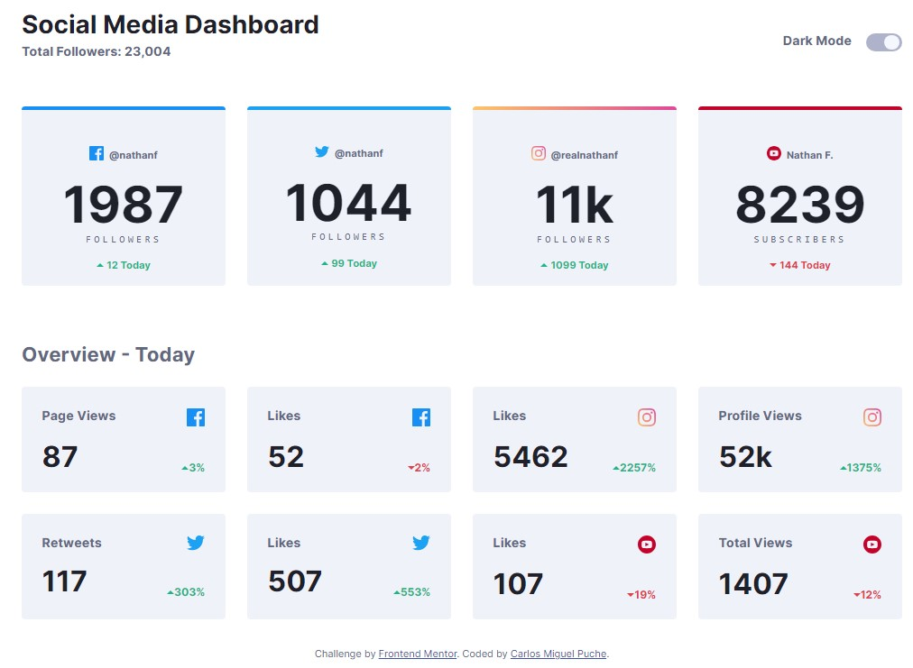
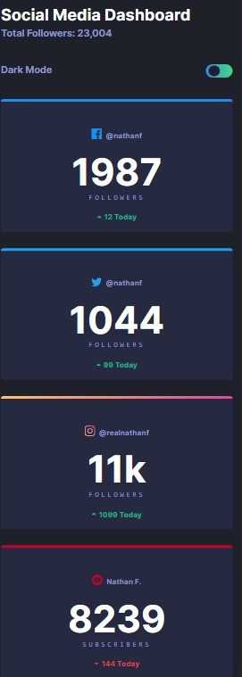

# Social Media Dashboard with Theme Switcher: Advanced DOM Logic

> [!Note]
>> This repository contains a legacy project from my early days as a programmer

This repository is evidence of my learning journey. It represents a project I undertook to refine my layout and component logic skills before my current specialization in Full Stack development.

**Note:** The design and assets were provided by Frontend Mentor. My role was the technical implementation from scratch.
---

## 🌟 About this project
This is a fully responsive Social Media Dashboard that features a functional **Dark/Light mode switcher**. The challenge focused on maintaining visual consistency across two very different color palettes while handling multiple data cards.

The core objective was to move beyond "hardcoded" style changes and implement a scalable way to toggle themes using JavaScript, ensuring that every element—from the background to the smallest text—adapts correctly to the user's preference.

---

## 🚀 Links
* **Live Demo:** [SEE DEMO HERE](https://cmp2007.github.io/social-media-dashboard-with-theme-switcher/)
* **Frontend Mentor Profile:** [View my solutions](https://www.frontendmentor.io/profile/CMP2007)
* **Original Challenge:** [Social media dashboard with theme switcher](https://www.frontendmentor.io/solutions/social-media-dashboard-dQv4Kg_ZEk)

---

### Screenshot

---

## 📋 Evolution & Context Note
> ⚠️ **Note on my trajectory:** This project marks the point where I started focusing on **DRY (Don't Repeat Yourself)** principles in JavaScript. Instead of manually changing each element's style, I implemented a logic based on arrays and loops to manage theme transitions efficiently.

## 📋 Technical Milestones of this Stage
In this phase of my learning, I successfully implemented:

* **Efficient Theme Toggling:** Developed a JS function that iterates through grouped element arrays (`darkItems`) to apply or remove CSS classes in a single flow, optimizing performance and code readability.
* **Complex CSS Grid Layouts:** Created a responsive grid that automatically adjusts from a single column on mobile to a multi-column layout on desktop using `repeat(auto-fit, minmax(200px, 1fr))`.
* **Advanced CSS Customization:** Extensive use of CSS Variables (`:root`) and linear gradients for borders (like the Instagram card) and interactive elements.
* **Custom UI Components:** Built a fully custom toggle switch from scratch using a hidden checkbox and stylized labels with smooth CSS transitions.
* **State Validation:** Implementation of a validation logic for the switch state, ensuring the "Dark Mode" class is applied consistently across the entire `body`.

## 🛠️ Technologies (at the time)
* **Vanilla JavaScript:** Array handling, `forEach` loops, and classList manipulation.
* **HTML5 & CSS3:** CSS Grid, Flexbox, Custom Properties (Variables), and Pseudo-elements.
* **Responsive Design:** Mobile-first approach with advanced Media Queries.
